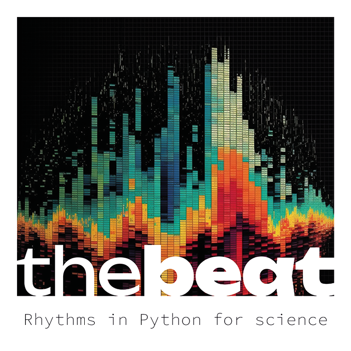

# *thebeat*: Rhythms in Python for Science

*thebeat* is a Python package for working with temporal sequences and rhythms in the behavioural and cognitive sciences. It provides functionality for creating stimuli, and for visualizing and analyzing temporal data.

*thebeat* will save you time when creating experiments or analyzing data. 
It is a collection of widely accepted methods for use in timing research. 
*thebeat* is an open-source, on-going, and collaborative project, 
integrating easily with the existing Python ecosystem, and with your own scripts. 
The package was specifically designed to be useful for both skilled and novice programmers.

# Documentation
The package documentation is available from [https://docs.the-beat.info](https://docs.the-beat.info).

# Installation

*thebeat* can be installed from PyPI using pip:

```bash
pip install thebeat
```

# Getting started
The code below illustrates how we might create a simple trial for use in an experiment:

```python
from thebeat import Sequence, SoundStimulus, SoundSequence

seq = Sequence.generate_isochronous(n_events=10, ioi=500)
stim = SoundStimulus.generate(freq=440, duration_ms=50, onramp_ms=10, offramp_ms=10)
trial = SoundSequence(stim, seq)

trial.play()  # play sound over loudspeakers
trial.plot_waveform()  # plot as sound waveform
trial.plot_sequence()  # plot as an event plot
trial.write_wav('example_trial.wav')  # save file to disk
```
# Collaborators
Jelle van der Werff, Andrea Ravignani, and Yannick Jadoul.

